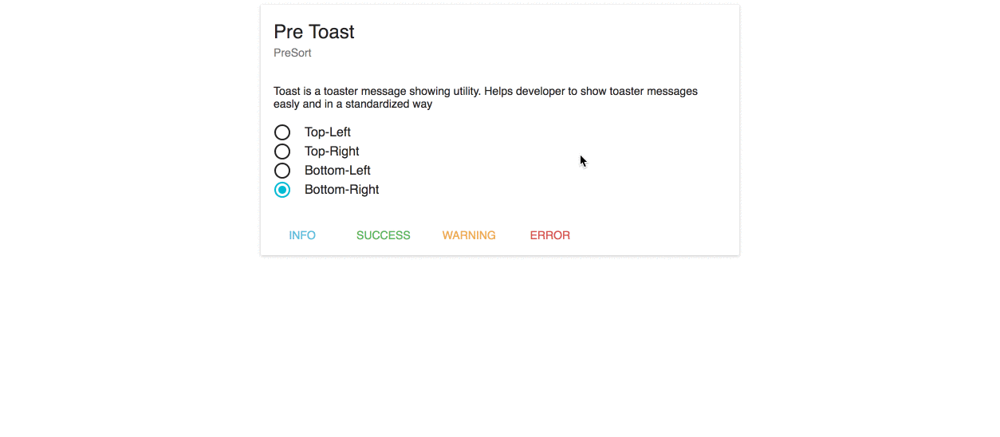

# Pre Toast


## Installation

```
npm install --save pre-toast
```

## Usage

```js
import React from 'react';
import Toast from "pre-toast/lib/Toast";

class Example extends React.Component {

  createToast = (type) => {
    return () => {
      switch (type) {
        case 'info':
          Toast.info('Info message');
          break;
        case 'success':
          Toast.success('Success message', 'Title here');
          break;
        case 'warning':
          Toast.warning('Warning message', 'Close after 3000ms', 3000);
          break;
        case 'error':
          Toast.error('Error message', 'Click me!', 5000, () => {
            alert('callback');
          });
          break;
      }
    };
  };

  render() {
    return ( 
        <div>
            <button className='btn btn-info'
              onClick={this.createToast('info')}>Info
            </button>
            <hr/>
            <button className='btn btn-success'
              onClick={this.createToast('success')}>Success
            </button>
            <hr/>
            <button className='btn btn-warning'
              onClick={this.createToast('warning')}>Warning
            </button>
            <hr/>
            <button className='btn btn-danger'
              onClick={this.createToast('error')}>Error
            </button>
      </div>
    );
  }
}

export default Example;

```


## Toast Props

| Name | Type | Default | Required | Description |
|------|------|---------|----------|------------ |
| position | string | "top-right" | false | Desired position of toast to be shown on screen - "top-right" , "top-left" , "bottom-left" , "bottom-right" |
| maxVisible | number | 5 | false | any number |
| timeBar | bool | true | false | Toast timeout duration bar |

```js

let config={
    position:"top-left",
    maxVisible:5,
    timeBar: false
}

Toast.configuration(conf);
```

## Toast API

- Toast.info(message, title, timeOut, callback);
- Toast.success(message, title, timeOut, callback);
- Toast.warning(message, title, timeOut, callback);
- Toast.error(message, title, timeOut, callback);

| Name | Type | Description |
|------|------|-------------|
| message | string | The message string |
| title | string | The title string |
| timeOut | integer | The popup timeout in milliseconds |
| callback | function | A function that gets fired when the popup is clicked |

### Quick Start

#### 1. Get the latest version
You can start by cloning the latest version of pre-toast.

#### 2. Run `npm install`
This will install both run-time project dependencies and developer tools listed
in [package.json](./package.json) file.

#### 3. How to start project in Development Mode

This will start the development server and serve site application.

```shell
$ npm start
```
  
Open Browser and enter `http://localhost:3000` (default) 

### How to Build for Production

If you need just to build the app (without running a dev server), simply run:

```shell
$ npm run build
```

### How to Build for Site

If you need just to build the app (without running a dev server), simply run:

```shell
$ npm run site
```